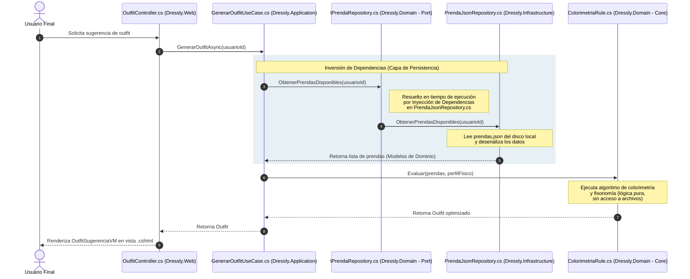
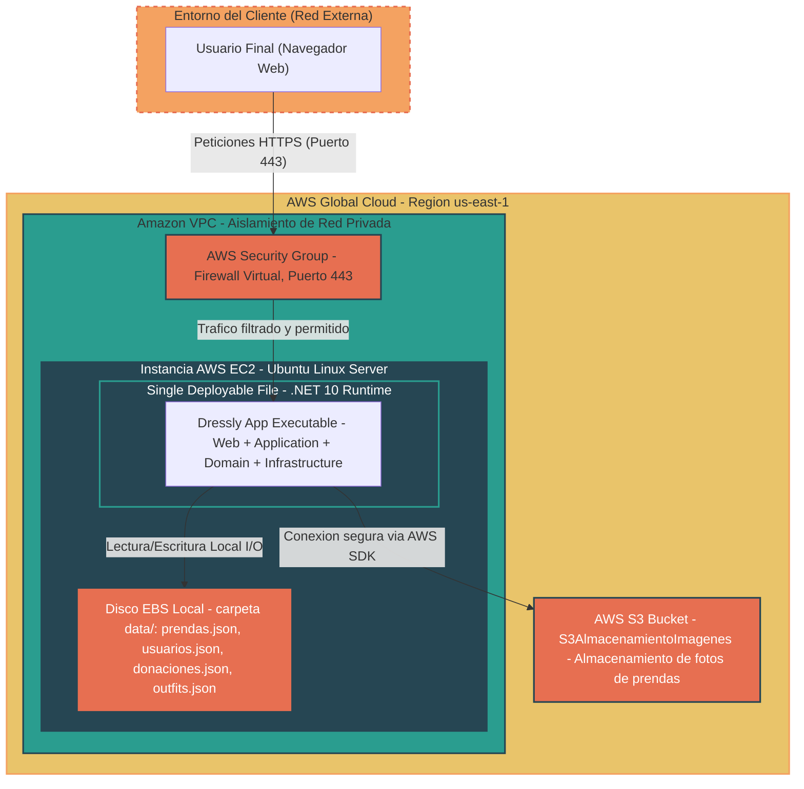

    <h1>ADR-03-Giovana-Diaz</h1>
    <h1>ADR-03: Cambio de diagrama de vistas para el proyecto Dressly</h1>

---

| Campo  | Valor |
|--------|-------|
| Autor  | Giovana Ruby Díaz Anduze |
| Fecha  | 15/05/2026 |
| Estado | `Propuesto` |

---
## Contexto

### Problemática y justificación del proyecto
Actualmente, muchas personas se responden una pregunta que se realizan todos los días: ¿Qué outfit me pondré hoy?, esto puede llegar a ser cansado para algunos, pues a pesar de contar con ropa suficiente dentro de su armario, ocurre ese sentimiento de no saber qué ponerse debido a que no recuerdan las prendas que tienen y no saben cómo combinarlas, sumándole el hecho de que muchos usuarios realizan compras innecesarias desconociendo datos acerca de su propio tipo de cuerpo y colorimetría, como al no saber qué tipos de cortes y tonos les favorecen, adquiriendo prendas que terminan sin un solo uso; esto formando parte del consumo desmedido e innecesario de ropa, y acumulación de desperdicio textil que pierde la oportunidad de ser aprovechado por otros. 

El proyecto busca resolver la pérdida de tiempo y el agobio que sentimos al elegir un outfit, dándonos sugerencias rápidas que ya no sea un proceso cansado; por otro lado, también ayuda en poner orden en el descontrol de prendas del armario, evitando que compremos ropa casi igual a la que ya tenemos solo porque no recordamos que está ahí, de igual manera, resuelve el problema de comprar por impulsividad prendas que no nos favorecen, ayudando a elegir prendas que realmente favorezcan nuestras características físicas. Finalmente, el proyecto ayuda a resolver un problema que persiste actualmente que es el hiperconsumismo de textiles, contribuyendo a la economía circular y facilitando a donarla a quiénes la necesiten y dándole un propósito mejor a lo que ya nos ponemos.

El proyecto va dirigido a personas que buscan una nueva forma de gestionar su guardarropa y buscan tener recomendaciones basadas en sus características físicas, así como personas comprometidas con la economía circular que requieren una vía eficiente para canalizar sus prendas en desuso.

> [!IMPORTANT]
> ### Explicación de este ADR
> En el diagrama anterior se optó por hacer un cambio con respecto a la arquitecura de mi proyecto, Dressly, esto porque desde el principio pensaba que sea en un sistema web; sin embargo, conforme tuvimos las clases con el profesor Jorge Pedrozo, he optado por hacer un cambio radical de ser una arquitectura por capas (Dominio, Aplicación y Persistencia) a una hexagonal (Infraestrcutura, Aplicación y Dominio) esto no sólo hace que pueda estar en un entorno web, sino que también en uno móvil. Sabiendo esto, es por ello que he querido adicionar este ADR pues a pesar que no forma parte de la tarea de la entrega de la actividad #20 de mi proyecto, quiero hacerlo para que pueda llevar un mejor control de cómo va a servir las vistas y tener una mejor organización al momento de empezar a desarrollar este proyecto y no olvidarlo después de un tiempo.

---

## Restricciones 

Las restricciones de este proyecto académico sigue siendo el tiempo estimado de desarrollo de la app, pues principalmente se cuenta con un tiempo muy limitado para la entrega y avances de desarrollo del sistema; igualmente, el enfoque del proyecto, Dressly, debe centrarse específicamente para verificar de forma eficiente del flujo de los datos como:

- El estilo del usuario
- Gestión del inventario
- Inteligencia para la vestimenta
- El apartado para el módulo de economía circular

Implementando estos elementos sin añadir mayores complejidades de red mucho más avanzadas para el principio del proyecto.

---

## Decisión

Después de investigar y analizar las diferentes opciones de estilos arquitectónicos que existen, se ha optado en adoptar un enfoque de arquitectura hexagonal (puertos y adaptadores) para el desarrollo del proyecto. Con ello, podemos destacar que el estilo se caracteriza por organizar el sistema en tres anillos concéntricos: **Dominio** (núcleo), **Aplicación** (casos de uso y puertos) y la **Infraestructura/Adaptadores** (detalles técnicos), completada con el Modelo de Vistas (Lógica, Desarrollo, Procesos, Despliegue) para mantener la cobertura de comunicación hacia todos los interesados.

### **1. Vista Lógica (¿Qué hace el sistema?)**
Se mantienen los cuatro dominios funcionales, pero ahora expresados como núcleo hexagonal:
- *Módulo de Catálogo de Prendas:* Inventario y categorización.
- *Módulo de Inteligencia de Outfits:* algoritmos de combinación estilística.
- *Módulo de Perfil y Biometría:* características físicas del usuario.
- *Módulo de Economía Circular:* directorio de donaciones y ONGs.

Cada módulo se modela como un conjunto de **entidades y reglas de negocio puras**, sin dependencias hacia frameworks ni mecanismos de persistencia.

  <h2>Diagrama de vista lógica</h2>

  
  
<em>Figura 1: Vista Lógica de Dressly — módulos de negocio y sus relaciones</em>

### 2. Vista de Desarrollo (¿Cómo está organizado el código?)
La solución .NET se reorganiza en proyectos alineados al hexagono:

- **Dressly.Domain**
    - *Entidades:* Prenda, Outift, PerfilUsuario, Donación.
    - Lógica pura de colorimetría, reglas de combinación y reglas de donación.
    - Sin referencias a ningún otro proyecto.

- **Dressly.Application**
    - Casos de uso (Use Cases / Services): Generar SugerenciaOutfit, RegistrarPrenda, PublicarDonación, etc.
    - **Puertos de entrada** (interfaces que exponen los casos de uso, ej. `IOutfitService`).
    - **Puertos de salida** (interfaces que el dominio necesita, ej. `IPrendaRepository`, `IAlmacenamientoImagenes`, `INotificadorDonaciones`).
    - Depende únicamente de Dressly.Domain.

 - **Dressly.Infrastructure**
    -  Implementaciones concretas de los puertos de salida.
    -  `JsonPrendaRepository`, `JsonOutfitRepository`, `JsonDonacionRepository` (persistencia en archivos JSON).
    - `S3AlmacenamientoImagenes` (adaptador para AWS S3).
    - Depende de Dressly.Application (implementa sus interfaces) y de Dressly.Domain.
  
- **Dressly.Web**
    - Controladores y Vistas MVC.
    - Traducen peticiones HTTP en llamdas a los puertos de entrada (casos de uso de Dressly.Application).
    - Configura la inyección de dependencias: conecta los puertos con sus adaptadores concretos (`JsonPrendaRepository`, `S3AlmacenamientoImagenes`).
    - Depende de Dressly.Application; no contiene lógica de negocio.

  <h2>Diagrama de vista de desarrollo</h2>

  
<em>Figura 2: Vista de Desarrollo de Dressly</em>

### 3. Vistas de Procesos (¿Cómo se comporta en tiempo de ejecución?)
Caso de uso prioritario: **Generar una sugerencia de Outfit compatible**

1. El usuario interactúa con **Dressly.Web** (adaptador de entrada)
2. El controlador invoca al puerto de enetrada `IOutfitService.GenerarSugerencia(...)` definido en Dressly.Application.
3. El caso de uso, dentro de Dressly.Application, ejecuta la lógica orquestadora y solicita las prendas a través del puerto de salida `IPrendaRepository`.
4. **Dressly.Infrastructure** resuelve ese puerto mediante `JsonPrendaRepository`, leyendo el archivo JSON correspondiente.
5. Las entidades de **Dressly.Domain** computan la colorimetría y las reglas de compatibilidad de outfits (lógica pura, sin dependencias externas).
6. El resultado regresa al caso de uso, que lo entrega al puerto de entrada, y este controlador, que lo renderiza en la vista.

La diferencia clave frente al monolito en capas es que el flujo **nunca involucra una implementación concreta.**

  <h2>Diagrama de vista de procesos</h2>

    
Figura 3: Vista de desarrollo

### 4. Vista de Despliegue (¿Dónde corre físicamente?)
Se mantiene el mapa de infraestructura física en AWS:

- Una instancia en EC2 ejecutando los cuatro proyectos compilados (Web, Application, Domain, Infrastructure) como un único desplegable.
- Un Bucket S3 para el almacenamiento de imágenes de prendas, accedido mediante el adaptador `S3AlmacenamientoImagenes`.
- Aislamiento de red mediante una VPC con accesos controlados por Security Groups.

  <h2>Diagrama de vista de despliegue</h2>

    
Figura 4: Vista de despliegue

---

## ¿Por qué he optado por esta decisión?

He decidido hacer este cambio principalmente por las siguientes razones:
1. **Independencia del dominio frente a la persistencia:** Actualmente la persistencia con la que cuenta el programa es mediante archivos JSON locales, pero podría migrar a una base de datos o cambiar de proveedor en cualquier momento, al implementar una arquitectura hexagonal, ese cambio se resuelve creando un nuevo adaptador sin tocar el núcleo de negocio.
  
2. Testabilidad del núcleo de negocio.** Tú lógica de colorimetría, reglas de combinación de outfits y reglas de donación pueden probarse de forma aislada, sin depender de MVC, archivos JSON ni AWS.
   
3. **Reutilización futura del dominio:** Si en algún momento necesitas otras "entrada" al sistema (una API móvil, un worker que procese imágenes, etc.), todas pueden reutilizar las mismas reglas de negocio definidas en Dressly.Domain sin duplicar código.
   
4. ***Coherencia entre el lenguaje del negocio y el código:** El núcleo (Catálogo, Inteligencia de Outfits, Perfil/Biometría, Economía Circular) queda expresado en términos del dominio, sin que conceptos técnicos como JSON, S3 o MVC contaminen esa capa.

5. **Inversión de dependencias real.** A diferencia del monolito en capas, en hexagonal toda dependencia apunta hacia el Dominio, y la Infraestructura depende de las abstracciones (puertos) definidas en Application, esto elimina por diseño las dependencias circulares. 
   
---

### Alternativas consideradas y la razón del por qué las descarté para el proyecto

- **Arquitectura de Microservicios** : la pensé pues permite aislar el módulo de donación o la inteligencia de vestimenta en servidores independiente; sin embargo, la descarté porque añade una complejidad alta para la comunicación de red y bases de datos distribuida, y se sobrepasa del tiempo disponible para el proyecto.

- **Mantener la arquitectura monolítica en capas (ADR-02 original).**
   - **Razón de descarte:** Aunque cumplía con las cuatro vistas requeridas, las dependencias fluían de Presentación → Dominio → Infraestructura de forma rígida, dificultando sustituir la persistencia JSON por otra tecnología sin modificar el núcleo de negocio. La arquitectura hexagonal resuelve esto explícitamente mediante puertos.

- **Arquitectura Limpia (Clean Architecture) en su formulación de círculos concéntricos genérica.**
   - **Razón de descarte:** Es conceptualmente muy similar a la hexagonal y comparte la regla de dependencia hacia el dominio, pero su nomenclatura de capas (Entities, Use Cases, Interface Adapters, Frameworks) es menos explícita en cuanto a la simetría entrada/salida que ofrece el lenguaje de "puertos y adaptadores", el cual se ajusta mejor a la necesidad de modelar tanto adaptadores de entrada (Web) como de salida (JSON, S3) de forma simétrica.

---

## Consecuencias

### Lo que gano

- **Independencia del dominio:** La lógica de colorimetría y reglas de outfits puede probarse sin archivos JSON, sin MVC y sin AWS.
- **Sustituibilidad:** Cambiar de persistencia JSON a otra tecnología (o de S3 a otro almacenamiento) implica crear un nuevo adaptador, sin tocar Domain ni Application.
- **Coherencia con el lenguaje del negocio:** El núcleo expresa Catálogo, Outfits, Perfil y Economía Circular sin contaminación técnica.
- **Alineación con la rúbrica:** Se mantienen las 4 vistas requeridas, ahora reinterpretadas bajo el enfoque hexagonal.

### Lo que sacrifico o asumo

- **Mayor cantidad de proyectos e interfaces:** Pasar de 3 a 4 proyectos (.NET) y la introducción de puertos añade complejidad estructural inicial respecto al monolito en capas.
- **Esfuerzo de migración:** El código existente de Dressly.Web debe reorganizarse: la lógica de negocio embebida en controladores debe extraerse hacia Dressly.Application y Dressly.Domain.
- **Esfuerzo de sincronización:** Como en la versión anterior, cualquier cambio funcional requiere actualizar manualmente los diagramas en draw.io/Mermaid.

---

> [!NOTE]
> ## Declaración de uso de IA
> Para la elaboración de este ADR se utilizó Claude y Gemini como herramienta de asistencia en la redacción y estructuración del documento. Todas las decisiones de diseño, el análisis de alternativas y la justificación técnica aplicada al contexto de Dressly son propias de la autora. La IA fue utilizada como apoyo para expresar y documentar de forma clara las decisiones previamente razonadas.
