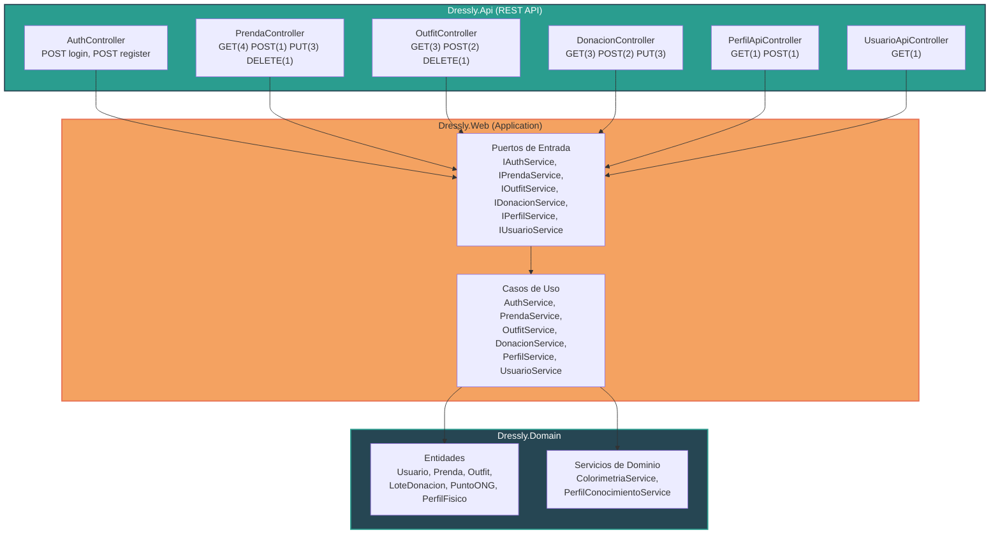

# ADR-04-Giovana-Diaz

# ADR-04: Incorporación de Dressly.Api como capa de presentación REST API

| Campo  | Valor |
|--------|-------|
| Autor  | Giovana Ruby Díaz Anduze |
| Fecha  | 26/06/2026 |
| Estado | `Propuesto` |

---

## Contexto

Dressly inició como una aplicación web MVC con vistas Razor en el proyecto `Dressly` (Dressly.Web.csproj). Sin embargo, al evolucionar la arquitectura a hexagonal (ADR-02 y ADR-03), el dominio y los casos de uso quedaron desacoplados de la presentación, lo que abre la posibilidad de agregar otras interfaces sin modificar el núcleo del negocio.

Se identificó la necesidad de exponer la funcionalidad de Dressly mediante una **API REST** independiente del MVC por las siguientes razones:
- Consumir los servicios desde la rama `Dressly.Gof` para implementar notificaciones SMS/Email.
- Separar la lógica de presentación web (Razor) de la lógica de intercambio de datos (JSON).
- Tener una interfaz programática que pueda ser consumida por clientes móviles, scripts de prueba o servicios externos.

---

## Restricciones

- Tiempo limitado para la entrega del proyecto académico.
- Los endpoints deben ser simples y no requerir autenticación JWT (se pasa `usuarioId` directamente en la ruta).
- Deben reutilizar los servicios y puertos ya definidos en `Dressly.Web` (Application).
- No se debe modificar el código existente del proyecto MVC ni del dominio.

---

## Decisión

Se creó el proyecto `Dressly.Api` como un proyecto **ASP.NET Core Web API** dentro de la misma solución, que actúa como un **adaptador de entrada** (input adapter) en la arquitectura hexagonal.

### Diseño de los controladores

Se implementaron **6 controladores** en `Dressly.Api/Controllers/`:

| Controlador | Ruta base | Endpoints | Métodos |
|---|---|---|---|
| `AuthController` | `api/auth` | 2 | `POST login`, `POST register` |
| `PrendaController` | `api/prenda` | 9 | GET (4), POST (1), PUT (3), DELETE (1) |
| `OutfitController` | `api/outfit` | 6 | GET (3), POST (2), DELETE (1) |
| `DonacionController` | `api/donacion` | 8 | GET (3), POST (2), PUT (3) |
| `PerfilApiController` | `api/perfil` | 2 | GET (1), POST (1) |
| `UsuarioApiController` | `api/usuario` | 1 | GET (1) |

Total: **26 endpoints REST**.

### Principios de diseño

- **Rutas semánticas**: `api/prenda/usuario/{id}/disponibles`, `api/donacion/{id}/entregar`
- **`usuarioId` en la ruta**: Se pasa como parámetro de ruta en lugar de usar JWT, simplificando las pruebas.
- **DTOs de request**: Records específicos (`CreatePrendaRequest`, `RegistrarDonacionRequest`, etc.) para cada operación POST/PUT.
- **Reutilización de servicios**: Los controladores inyectan directamente los puertos de entrada (`IPrendaService`, `IOutfitService`, etc.) sin contener lógica de negocio.
- **Namespace consistente**: Todos en `Dressly.Api.Controllers`.

### Correcciones aplicadas

- Los controladores originales llamaban métodos inexistentes (`GetAllAsync`, `AddAsync`). Se reescribieron para llamar a los métodos reales de los servicios (`GetPrendasAsync`, `CrearAsync`).
- `AuthController` tenía un error de tipo (tupla vs objeto), se corrigió.
- Se eliminaron controladores MVC (`HomeController`, `PerfilController`, `UsuarioController`) que estaban duplicados dentro del proyecto API.
- Se eliminó `JsonHelper.cs` (código muerto).
- Se renombró el namespace `Dressly_MVC.Repositories` → `Dressly.Infrastructure.Repositories` en los 5 repositorios y ambos `Program.cs`.

---

## Alternativas consideradas

- **JWT Authentication**: Se consideró implementar autenticación con tokens JWT para identificar al usuario. Se descartó porque añade complejidad innecesaria para un proyecto académico donde el `usuarioId` se conoce y se pasa directamente.
- **Un solo controlador gigante**: Se evaluó tener un único controlador con todos los endpoints. Se descartó porque viola el principio de responsabilidad única y hace el código difícil de mantener.
- **Endpoints en el proyecto MVC existente**: Se consideró agregar las rutas API al mismo proyecto web MVC. Se descartó porque mezcla responsabilidades de presentación (Razor) con intercambio de datos (JSON).

---

## Consecuencias

### Lo que gano

- La API puede ser consumida por la rama `Dressly.Gof` y cualquier cliente externo.
- Los 26 endpoints cubren todas las operaciones CRUD y de negocio definidas en los servicios.
- Separación limpia entre la interfaz web (MVC) y la interfaz de datos (API).
- Fácil de probar desde el navegador (GET) o con herramientas como Postman/fetch.

### Lo que sacrifico o asumo

- Sin autenticación, cualquier usuario que conozca un `usuarioId` puede acceder a sus datos.
- No hay validación de permisos ni roles en la API.
- Las fotos de prendas no se pueden subir desde la API (no se implementó multipart/form-data).
- El proyecto `Dressly.Api` comparte las mismas dependencias que el MVC, aumentando el tamaño del build.

---

## Diagrama

---

## Declaración de uso de IA

Para la elaboración de este ADR se utilizó Claude (Anthropic) como herramienta de asistencia en la redacción y estructuración del documento. Todas las decisiones de diseño, el análisis de alternativas y la justificación técnica aplicada al contexto de Dressly son propias de la autora. La IA fue utilizada como apoyo para expresar y documentar de forma clara las decisiones previamente razonadas.
