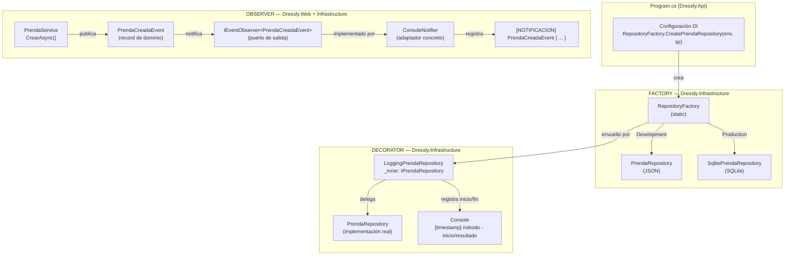

<div align = "center">
    <h1>ADR-05-Giovana-Diaz</h1>
    <h1>ADR-05: Integración de Patrones de Diseño GOF en Dressly</h1>
</div>

---

| Campo  | Valor |
|--------|-------|
| Autor  | Giovana Ruby Díaz Anduze |
| Fecha  | 26/06/2026 |
| Estado | `Propuesto` |

---

## Contexto

El siguiente paso para este proyecto es enriquecer la infraestructura del sistema con patrones de diseño GOF (Gang of Four) que resuelvan problemas concretos de Dressly sin romper la separación entre dominio, aplicación e infraestructura.

Los tres problemas identificados fueron:

- **Creación de repositorios:** en `Program.cs` se necesita decidir en tiempo de ejecución qué implementación concreta (JSON o SQLite) instanciar según el entorno, sin que Application ni Domain lo sepan.
- **Notificaciones al crear prendas y outfits:** cuando el usuario crea una prenda o guarda un outfit, otros componentes del sistema (notificadores, loggers, futuros servicios) deben enterarse sin que `PrendaService` ni `OutfitService` dependan directamente de ellos.
- **Logging transversal en repositorios:** cada operación de repositorio debe registrarse (entrada y salida) sin modificar las implementaciones concretas de JSON, CSV ni SQLite.

---

## Decisión

Se integran tres patrones GOF, cada uno resolviendo uno de los problemas identificados:

### 1. Factory Method — `RepositoryFactory`

**Problema:** `Program.cs` necesita instanciar el repositorio correcto según el entorno (`Development` → JSON, `Production` → SQLite) sin que Application conozca las implementaciones concretas.

**Solución:** Una clase estática `RepositoryFactory` en `Dressly.Infrastructure` expone métodos de creación por entidad. Recibe el nombre del entorno y un `IServiceProvider`, y devuelve la implementación adecuada a través del puerto de salida.

```csharp
// Dressly.Infrastructure/Repositories/RepositoryFactory.cs
public static IPrendaRepository CreatePrendaRepository(string environment, IServiceProvider sp)
{
    if (environment == "Production")
    {
        var db = sp.GetRequiredService<SqliteDbContext>();
        return new SqlitePrendaRepository(db);
    }
    return new PrendaRepository(); // JSON
}
```

**Resultado:** `Program.cs` solo llama a `RepositoryFactory.CreatePrendaRepository(env, sp)` y obtiene la instancia correcta. Agregar un nuevo adaptador (por ejemplo, PostgreSQL) solo requiere añadir un caso en el factory, sin tocar ningún otro archivo.

---

### 2. Observer — `IEventObserver<TEvent>` + `ConsoleNotifier`

**Problema:** `PrendaService` y `OutfitService` deben notificar eventos del dominio (`PrendaCreadaEvent`, `OutfitGeneradoEvent`, `DonacionRegistradaEvent`) sin acoplarse a los componentes que los consumen.

**Solución:** Se define el puerto de salida `IEventObserver<TEvent>` en `Dressly.Web` (Application). Los servicios mantienen una lista de observers suscritos y los notifican al final de la operación. `ConsoleNotifier<TEvent>` en `Dressly.Infrastructure` es el adaptador concreto que implementa ese puerto.

```csharp
// Dressly.Web/Ports/Output/IEventObserver.cs
public interface IEventObserver<in TEvent>
{
    Task HandleAsync(TEvent evento);
}

// Dressly.Web/UseCases/PrendaService.cs
var evento = new PrendaCreadaEvent(prenda.UsuarioId, prenda.Id, prenda.Nombre, DateTime.Now);
foreach (var obs in _prendaCreadaObservers)
    await obs.HandleAsync(evento);
```

```csharp
// Dressly.Infrastructure/Notifications/ConsoleNotifier.cs
public Task HandleAsync(TEvent evento)
{
    _logger.LogInformation("[NOTIFICACION] {Evento}", evento);
    return Task.CompletedTask;
}
```

**Resultado:** Cuando el usuario crea una prenda o guarda un outfit, `ConsoleNotifier` recibe el evento y lo registra en consola. Agregar un nuevo observer (email real, webhook, etc.) solo requiere implementar `IEventObserver<T>` y suscribirlo, sin modificar los servicios.

---

### 3. Decorator — `LoggingPrendaRepository` y familia

**Problema:** Se necesita registrar cada operación de repositorio (método invocado, parámetros, resultado) sin modificar las implementaciones concretas de JSON, CSV ni SQLite.

**Solución:** Cuatro clases Decorator en `Dressly.Infrastructure/Repositories/Decorators/` envuelven cada repositorio concreto. Implementan el mismo puerto de salida, delegan la operación al repositorio interno (`_inner`) y registran la entrada y salida con timestamp.

```csharp
// Dressly.Infrastructure/Repositories/Decorators/LoggingPrendaRepository.cs
public async Task<List<Prenda>> GetByUsuarioIdAsync(int usuarioId)
{
    Console.WriteLine($"[{DateTime.Now:yyyy-MM-dd HH:mm:ss}] PrendaRepository.GetByUsuarioIdAsync({usuarioId}) - inicio");
    var result = await _inner.GetByUsuarioIdAsync(usuarioId);
    Console.WriteLine($"[{DateTime.Now:yyyy-MM-dd HH:mm:ss}] PrendaRepository.GetByUsuarioIdAsync({usuarioId}) - {result.Count} items");
    return result;
}
```

**Resultado:** Cada llamada a repositorio queda registrada en consola con timestamp, nombre del método, parámetros y resultado, sin que `PrendaRepository`, `SqlitePrendaRepository` ni ningún otro adaptador sepa que está siendo decorado.

---

### Diagrama general — los tres patrones en Dressly



---

## Evidencia de funcionamiento

La siguiente captura muestra la consola de `Dressly.Api` durante la ejecución de un `POST /api/prenda` y un `POST /api/outfit`, donde se pueden observar los tres patrones actuando simultáneamente:

- **Decorator:** líneas `PrendaRepository.AddAsync(Vestido rosa) - inicio / guardado`, `GetAllAsync - 2 items`, `SaveAsync`, `OutfitRepository.AddAsync(Look casual) - inicio / guardado`
- **Observer:** líneas `[NOTIFICACION] PrendaCreadaEvent { ... }` y `[NOTIFICACION] OutfitGeneradoEvent { ... }`
- **Factory:** activo desde el arranque — el entorno `Development` resolvió `PrendaRepository` (JSON) como se observa en el content root path `Dressly.Api`

> **Nota:** La imagen de evidencia corresponde a la captura de pantalla tomada durante la sesión de pruebas del 26/06/2026.

---

