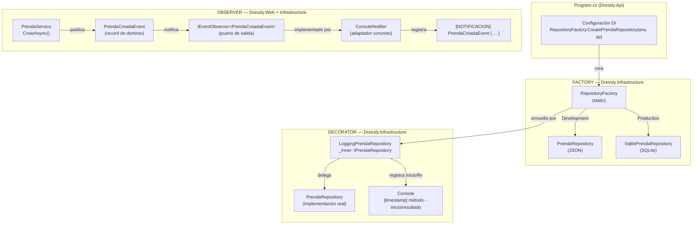

<div align = "center">
    <h1>ADR-05-Giovana-Diaz</h1>
    <h1>ADR-05: Integración de Patrones de Diseño GOF en Dressly</h1>
</div>

---

| Campo  | Valor |
|--------|-------|
| Autor  | Giovana Ruby Díaz Anduze |
| Fecha  | 26/06/2026 |
| Estado | `Propuesto` |

---

## Contexto
 
Con la arquitectura hexagonal establecida en ADR-03, el proyecto Dressly ya cuenta con puertos, adaptadores e inyección de dependencias funcionando. Sin embargo, tres problemas concretos quedaron sin una solución estructurada:
 
- **Creación de repositorios según el entorno:** `Program.cs` necesita decidir en tiempo de ejecución qué implementación concreta instanciar (JSON en Development, SQLite en Production) sin que Application ni Domain lo sepan.
- **Notificaciones al crear prendas y outfits:** cuando el usuario registra una prenda o guarda un outfit, otros componentes del sistema deben enterarse del evento sin que `PrendaService` ni `OutfitService` dependan directamente de ellos.
- **Logging transversal en repositorios:** cada operación de repositorio debe registrarse (qué método se llamó, con qué parámetros y qué resultado devolvió) sin modificar las implementaciones concretas de JSON, CSV ni SQLite.

Las restricciones siguen siendo las mismas que en ADRs anteriores: tiempo académico limitado, stack .NET 10 ya establecido y la condición de no romper la separación de capas lograda.

---

## Decisión
 
Se integran tres patrones de diseño GOF, cada uno resolviendo uno de los problemas identificados: **Factory Method**, **Observer** y **Decorator**.
 
### ¿Por qué?
 
**Factory Method (`RepositoryFactory`):** centraliza en un solo lugar la lógica de qué repositorio instanciar según el entorno. Recibe el nombre del entorno y un `IServiceProvider`, y devuelve la implementación adecuada a través del puerto de salida — sin que Application conozca las clases concretas. Agregar un nuevo adaptador (por ejemplo, PostgreSQL) solo requiere añadir un caso en el factory sin tocar ningún otro archivo.

```csharp
// Dressly.Infrastructure/Repositories/RepositoryFactory.cs
public static IPrendaRepository CreatePrendaRepository(string environment, IServiceProvider sp)
{
    if (environment == "Production")
    {
        var db = sp.GetRequiredService<SqliteDbContext>();
        return new SqlitePrendaRepository(db);
    }
    return new PrendaRepository(); // JSON por defecto
}
```

**Resultado:** `Program.cs` solo llama a `RepositoryFactory.CreatePrendaRepository(env, sp)` y obtiene la instancia correcta. Agregar un nuevo adaptador (por ejemplo, PostgreSQL) solo requiere añadir un caso en el factory, sin tocar ningún otro archivo.

---

**Observer (`IEventObserver<TEvent>` + `ConsoleNotifier`):** se define el puerto de salida `IEventObserver<TEvent>` en Application. Los servicios mantienen una lista de observers suscritos y los notifican al final de la operación. `ConsoleNotifier<TEvent>` en Infrastructure es el adaptador concreto. Agregar un nuevo observer (email, webhook) solo requiere implementar `IEventObserver<T>` y suscribirlo, sin modificar `PrendaService` ni `OutfitService`.
 
```csharp
// Publicación del evento en PrendaService.CrearAsync()
var evento = new PrendaCreadaEvent(prenda.UsuarioId, prenda.Id, prenda.Nombre, DateTime.Now);
foreach (var obs in _prendaCreadaObservers)
    await obs.HandleAsync(evento);
 
// ConsoleNotifier en Infrastructure
public Task HandleAsync(TEvent evento)
{
    _logger.LogInformation("[NOTIFICACION] {Evento}", evento);
    return Task.CompletedTask;
}
```
---

**Decorator (`LoggingPrendaRepository` y familia):** cuatro clases Decorator en `Dressly.Infrastructure/Repositories/Decorators/` envuelven cada repositorio concreto. Implementan el mismo puerto de salida, delegan la operación al repositorio interno (`_inner`) y registran entrada y salida con timestamp. El repositorio concreto no sabe que está siendo decorado.
 
```csharp
// Dressly.Infrastructure/Repositories/Decorators/LoggingPrendaRepository.cs
public async Task<List<Prenda>> GetByUsuarioIdAsync(int usuarioId)
{
    Console.WriteLine($"[{DateTime.Now:yyyy-MM-dd HH:mm:ss}] PrendaRepository.GetByUsuarioIdAsync({usuarioId}) - inicio");
    var result = await _inner.GetByUsuarioIdAsync(usuarioId);
    Console.WriteLine($"[{DateTime.Now:yyyy-MM-dd HH:mm:ss}] PrendaRepository.GetByUsuarioIdAsync({usuarioId}) - {result.Count} items");
    return result;
}
```

---

### Diagrama general — los tres patrones en Dressly



---

### Alternativas consideradas
 
| Alternativa | Por qué la descarté |
|-------------|---------------------|
| **Logging con AOP (Castle DynamicProxy / PostSharp)** | Requiere dependencias externas adicionales que añaden complejidad de configuración innecesaria para el alcance académico del proyecto; el Decorator manual resuelve el mismo problema con código propio. |
| **MediatR para eventos (en lugar de Observer manual)** | Añade una dependencia extra y una capa de abstracción que no se justifica cuando el Observer implementado directamente con `IEventObserver<T>` ya respeta los puertos hexagonales que tenemos. |
| **Abstract Factory en lugar de Factory Method** | Considerado para agrupar las cuatro familias de repositorios (Prenda, Usuario, Outfit, Donación), pero el número de variantes no justifica la complejidad adicional de definir interfaces de factory por familia; Factory Method estático es suficiente y más legible. |
| **Service Locator para creación de repositorios** | Resuelve el problema de instanciación pero oculta las dependencias, dificultando entender qué implementación está activa; Factory Method hace la decisión explícita y trazable. |
 
---

## Consecuencias
 
**✅ Lo que gano:**
 
- **Técnica:** los tres patrones operan sin modificar el dominio ni la capa de aplicación. Cambiar de JSON a SQLite, añadir un nuevo observer o desactivar el logging solo requiere tocar `Program.cs` o añadir una clase en Infrastructure — el núcleo de Dressly permanece intacto.
- **Proceso:** cada patrón tiene una responsabilidad clara y aislada, lo que hace que el código sea más fácil de explicar, revisar y extender en futuras entregas del proyecto.

**⚠️ Lo que sacrifico o asumo:**
- **Limitación técnica:** el Observer está suscrito manualmente en `Program.cs`, por lo que si se añaden muchos observers en el futuro, la configuración puede volverse verbosa y difícil de mantener sin un sistema de registro más sofisticado.
- **Deuda o riesgo:** el `RepositoryFactory` usa `string environment` como condición, lo que significa que un error tipográfico en el nombre del entorno podría silenciosamente activar el adaptador equivocado; en producción real convendría validar ese valor o usar un enum.


---

## Cláusula de IA
En este documento se ha utilizado Deepseek y Claude para la corrección de errores, refactorización de otras ramas integradas al proyecto y sugerencias para la redacción de este ADR. Todas las ideas y decisiones de diseño son propias de la autora y no fueron generadas la IA.