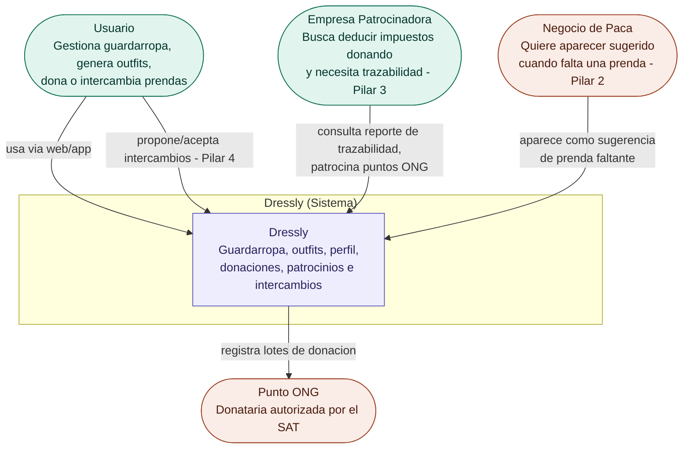
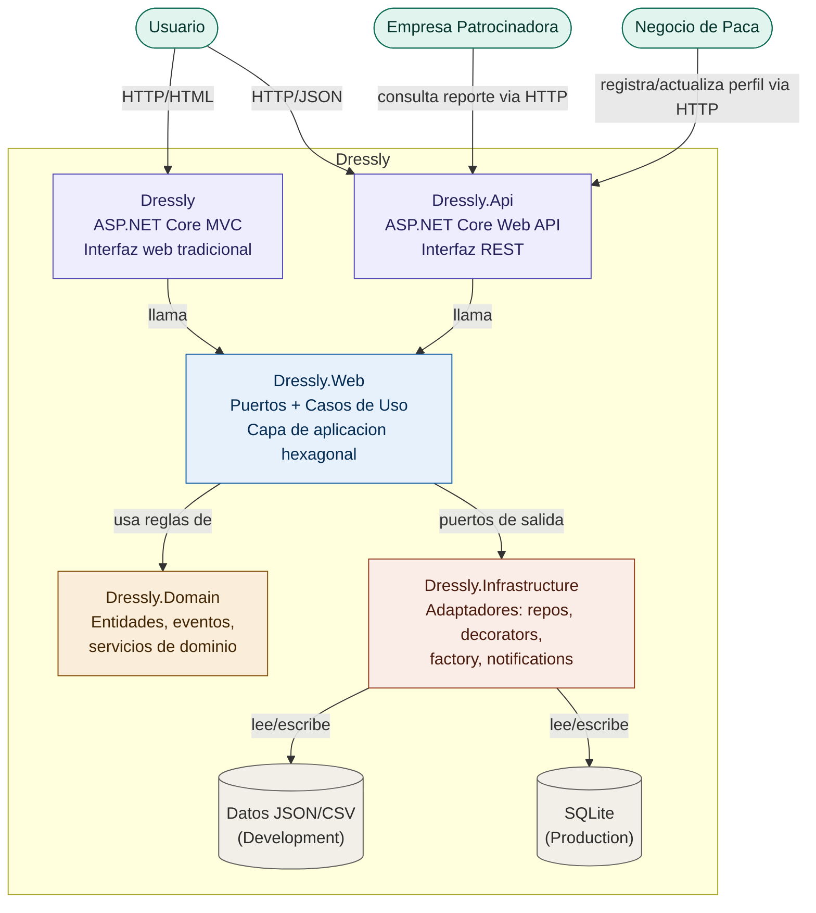
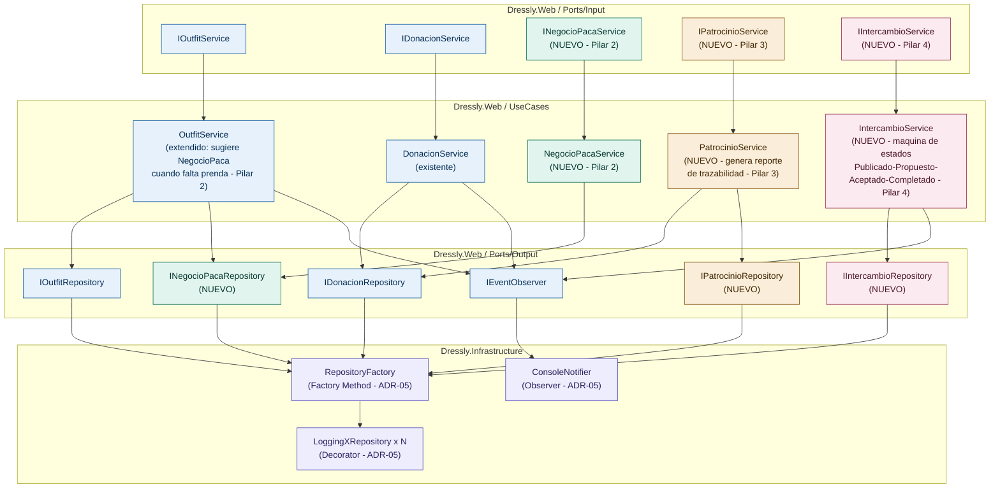

# Diagramas C4 — Dressly

Arquitectura documentada como código (Mermaid), versionada en el repositorio. Refleja el hexágono base (ADR-03), los patrones GOF ya integrados (ADR-05) y la extensión del modelo de negocio con los **Pilares 2, 3 y 4** (ADR-06).

---

## Nivel 1 — Contexto

**Para quién es:** cualquier persona no técnica: una empresa patrocinadora, un negocio local. No requiere saber nada de código.
**Pregunta que responde:** ¿Qué es Dressly y quién interactúa con él?

---

## Nivel 2 — Contenedores

*Para quién es:* los desarrolladores y arquitectos del equipo o para quienes revisan el codigo de forma técnica.
*Pregunta que responde:* ¿Cuáles son las piezas técnicas grandes de Dressly y cómo se comunican entre sí?

---

## Nivel 3 — Componentes

*Para quién es:* quien va a modificar o revisar el código de la capa de aplicación (Dressly.Web) e infraestructura.
*Pregunta que responde:* ¿Qué hay dentro del hexágono — qué servicios, puertos y patrones GOF ya implementados soportan los Pilares 2, 3 y 4?

