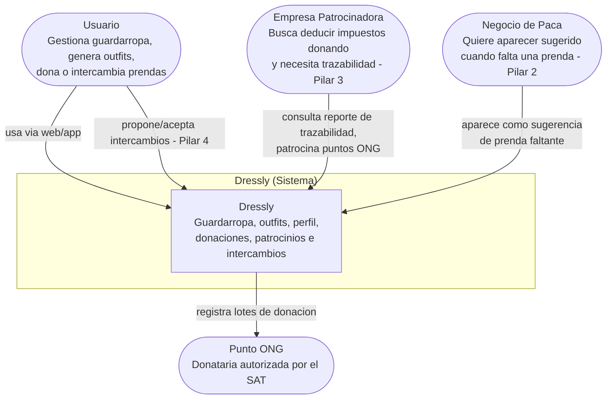
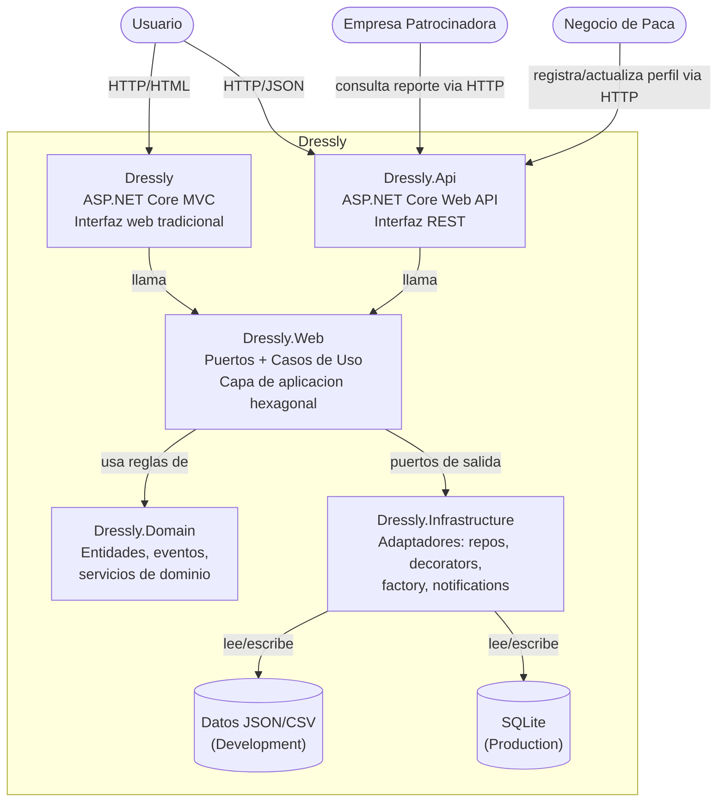

# Diagramas C4 — Dressly

Arquitectura documentada como código (Mermaid), versionada en el repositorio. Refleja el hexágono base (ADR-03), los patrones GOF ya integrados (ADR-05) y la extensión del modelo de negocio con los **Pilares 2, 3 y 4** (ADR-06).

---

## Nivel 1 — Contexto

**Para quién es:** cualquier persona no técnica — el profesor, una empresa patrocinadora, un negocio local. No requiere saber nada de código.
**Pregunta que responde:** ¿Qué es Dressly y quién interactúa con él?

---

## Nivel 2 — Contenedores

**Para quién es:** desarrolladores y arquitectos del equipo (o quien revise el repo técnicamente).
**Pregunta que responde:** ¿Cuáles son las piezas técnicas grandes de Dressly y cómo se comunican entre sí?

