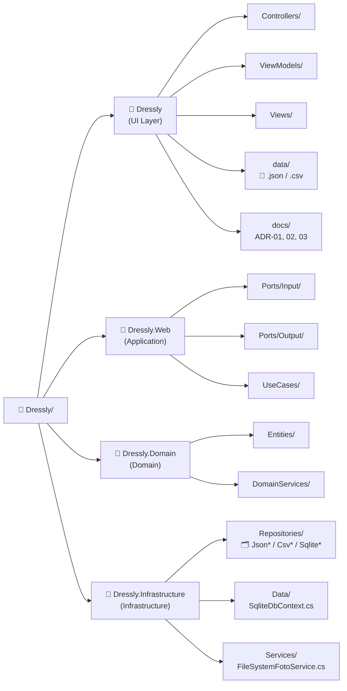
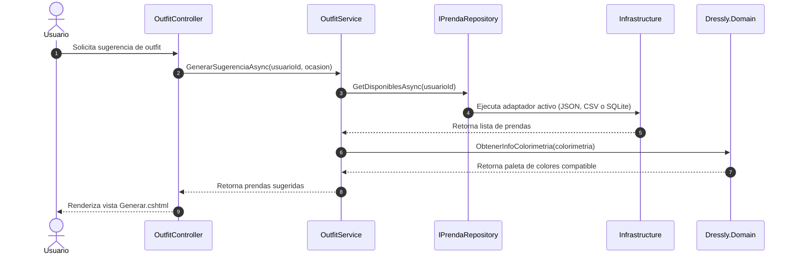
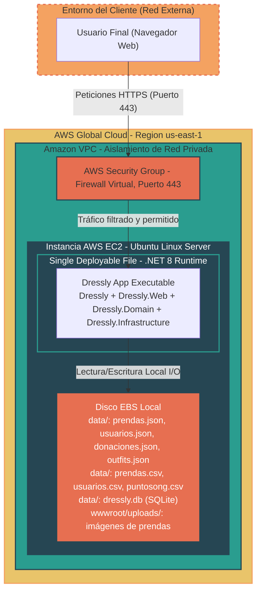

    <h1>ADR-03-Giovana-Diaz</h1>
    <h1>ADR-03: Cambio de diagrama de vistas para el proyecto Dressly</h1>

---

| Campo  | Valor |
|--------|-------|
| Autor  | Giovana Ruby Díaz Anduze |
| Fecha  | 15/05/2026 |
| Estado | `Reemplazado por ADR 04` |

---
## Contexto

### Problemática y justificación del proyecto
Actualmente, muchas personas se responden una pregunta que se realizan todos los días: ¿Qué outfit me pondré hoy?, esto puede llegar a ser cansado para algunos, pues a pesar de contar con ropa suficiente dentro de su armario, ocurre ese sentimiento de no saber qué ponerse debido a que no recuerdan las prendas que tienen y no saben cómo combinarlas, sumándole el hecho de que muchos usuarios realizan compras innecesarias desconociendo datos acerca de su propio tipo de cuerpo y colorimetría, como al no saber qué tipos de cortes y tonos les favorecen, adquiriendo prendas que terminan sin un solo uso; esto formando parte del consumo desmedido e innecesario de ropa, y acumulación de desperdicio textil que pierde la oportunidad de ser aprovechado por otros. 

El proyecto busca resolver la pérdida de tiempo y el agobio que sentimos al elegir un outfit, dándonos sugerencias rápidas que ya no sea un proceso cansado; por otro lado, también ayuda en poner orden en el descontrol de prendas del armario, evitando que compremos ropa casi igual a la que ya tenemos solo porque no recordamos que está ahí, de igual manera, resuelve el problema de comprar por impulsividad prendas que no nos favorecen, ayudando a elegir prendas que realmente favorezcan nuestras características físicas. Finalmente, el proyecto ayuda a resolver un problema que persiste actualmente que es el hiperconsumismo de textiles, contribuyendo a la economía circular y facilitando a donarla a quiénes la necesiten y dándole un propósito mejor a lo que ya nos ponemos.

El proyecto va dirigido a personas que buscan una nueva forma de gestionar su guardarropa y buscan tener recomendaciones basadas en sus características físicas, así como personas comprometidas con la economía circular que requieren una vía eficiente para canalizar sus prendas en desuso.

> [!IMPORTANT]
> ### Explicación de este ADR
> En el diagrama anterior se optó por hacer un cambio con respecto a la arquitecura de mi proyecto, Dressly, esto porque desde el principio pensaba que sea en un sistema web; sin embargo, conforme tuvimos las clases con el profesor Jorge Pedrozo, he optado por hacer un cambio radical de ser una arquitectura por capas (Dominio, Aplicación y Persistencia) a una hexagonal (Infraestrcutura, Aplicación y Dominio) esto no sólo hace que pueda estar en un entorno web, sino que también en uno móvil. Sabiendo esto, es por ello que he querido adicionar este ADR pues a pesar que no forma parte de la tarea de la entrega de la actividad #20 de mi proyecto, quiero hacerlo para que pueda llevar un mejor control de cómo va a servir las vistas y tener una mejor organización al momento de empezar a desarrollar este proyecto y no olvidarlo después de un tiempo.

---

## Restricciones 

Las restricciones de este proyecto académico sigue siendo el tiempo estimado de desarrollo de la app, pues principalmente se cuenta con un tiempo muy limitado para la entrega y avances de desarrollo del sistema; igualmente, el enfoque del proyecto, Dressly, debe centrarse específicamente para verificar de forma eficiente del flujo de los datos como:

- El estilo del usuario
- Gestión del inventario
- Inteligencia para la vestimenta
- El apartado para el módulo de economía circular

Implementando estos elementos sin añadir mayores complejidades de red mucho más avanzadas para el principio del proyecto.

---

## Decisión

Después de investigar y analizar las diferentes opciones de estilos arquitectónicos que existen, se ha optado en adoptar un enfoque de arquitectura hexagonal (puertos y adaptadores) para el desarrollo del proyecto. Con ello, podemos destacar que el estilo se caracteriza por organizar el sistema en tres anillos concéntricos: **Dominio** (núcleo), **Aplicación** (casos de uso y puertos) y la **Infraestructura/Adaptadores** (detalles técnicos), completada con el Modelo de Vistas (Lógica, Desarrollo, Procesos, Despliegue) para mantener la cobertura de comunicación hacia todos los interesados.

### **1. Vista Lógica (¿Qué hace el sistema?)**
Se mantienen los cuatro dominios funcionales, pero ahora expresados como núcleo hexagonal:
- *Módulo de Catálogo de Prendas:* Inventario y categorización.
- *Módulo de Inteligencia de Outfits:* algoritmos de combinación estilística.
- *Módulo de Perfil y Biometría:* características físicas del usuario.
- *Módulo de Economía Circular:* directorio de donaciones y ONGs.

Cada módulo se modela como un conjunto de **entidades y reglas de negocio puras**, sin dependencias hacia frameworks ni mecanismos de persistencia.

  <h2>Diagrama de vista lógica</h2>

  
  
<em>Figura 1: Vista Lógica de Dressly — módulos de negocio y sus relaciones</em>

### 2. Vista de Desarrollo (¿Cómo está organizado el código?)
La solución .NET se organiza en cuatro proyectos alineados al hexágono:

- **Dressly.Domain**
    - *Entidades:* `Prenda`, `Outfit`, `Usuario`, `PerfilFisico`, `LoteDonacion`, `PuntoONG`, `ColorimetriaInfo`, `TipoCuerpoInfo`, `ContrasteInfo`.
    - Lógica pura de colorimetría y reglas de combinación: `ColorimetriaService`, `PerfilConocimientoService`.
    - Sin referencias a ningún otro proyecto.

- **Dressly.Web** *(proyecto de aplicación — `Dressly.Application.csproj`)*
    - Casos de uso: `AuthService`, `PrendaService`, `OutfitService`, `PerfilService`, `DonacionService`, `UsuarioService`, `SeedService`.
    - **Puertos de entrada** (`Ports/Input/`): `IAuthService`, `IPrendaService`, `IOutfitService`, `IPerfilService`, `IDonacionService`, `IUsuarioService`, `ISeedService`, `IAlmacenamientoImagenes`.
    - **Puertos de salida** (`Ports/Output/`): `IPrendaRepository`, `IOutfitRepository`, `IDonacionRepository`, `IUsuarioRepository`.
    - Depende únicamente de `Dressly.Domain`.

- **Dressly.Infrastructure**
    - Implementaciones concretas de los puertos de salida, organizadas en tres familias de adaptadores intercambiables:
        - **JSON:** `JsonRepository` (base), `PrendaRepository`, `OutfitRepository`, `DonacionRepository`, `UsuarioRepository`.
        - **CSV:** `CsvRepository` (base), `CsvPrendaRepository`, `CsvOutfitRepository`, `CsvDonacionRepository`, `CsvUsuarioRepository`.
        - **SQLite:** `SqliteDbContext` (EF Core), `SqlitePrendaRepository`, `SqliteOutfitRepository`, `SqliteDonacionRepository`, `SqliteUsuarioRepository`.
    - `FileSystemFotoService`: adaptador de salida para almacenamiento local de imágenes de prendas.
    - Depende de `Dressly.Web` (implementa sus puertos) y de `Dressly.Domain`.

- **Dressly** *(proyecto web — `Dressly.Web.csproj`)*
    - Controladores MVC: `AuthController`, `PrendaController`, `OutfitController`, `PerfilController`, `DonacionController`, `UsuarioController`.
    - ViewModels y Vistas Razor.
    - `Program.cs`: configura la inyección de dependencias conectando cada puerto con el adaptador deseado (JSON, CSV o SQLite) mediante bloques comentables, sin modificar el dominio ni la aplicación.
    - Depende de `Dressly.Web` (Application); no contiene lógica de negocio.

  <h2>Diagrama de vista de desarrollo</h2>

  
<em>Figura 2: Vista de Desarrollo de Dressly</em>

### 3. Vistas de Procesos (¿Cómo se comporta en tiempo de ejecución?)
Caso de uso prioritario: **Generar una sugerencia de Outfit compatible**

1. El usuario interactúa con **Dressly** (adaptador de entrada MVC).
2. `OutfitController` invoca al puerto de entrada `IOutfitService.GenerarSugerenciaAsync(usuarioId, ocasion)` definido en `Dressly.Web` (Application).
3. `OutfitService`, dentro de Application, ejecuta la lógica orquestadora y solicita las prendas disponibles a través del puerto de salida `IPrendaRepository.GetDisponiblesAsync(usuarioId)`.
4. **Dressly.Infrastructure** resuelve ese puerto en tiempo de ejecución mediante el adaptador configurado en `Program.cs` — puede ser `PrendaRepository` (JSON), `CsvPrendaRepository` (CSV) o `SqlitePrendaRepository` (SQLite) — sin que Application ni Domain lo sepan.
5. Las entidades y servicios de **Dressly.Domain** (`ColorimetriaService`, `PerfilConocimientoService`) computan la paleta de colores compatible y las reglas de combinación de outfits (lógica pura, sin dependencias externas).
6. El resultado regresa al caso de uso, que lo entrega al controlador, que lo renderiza en la vista Razor.

La diferencia clave frente al monolito en capas es que el flujo **nunca involucra una implementación concreta** — el adaptador de persistencia es intercambiable sin tocar Domain ni Application.

  <h2>Diagrama de vista de procesos</h2>

  
<em>Figura 3: Vista de procesos</em>

### 4. Vista de Despliegue (¿Dónde corre físicamente?)
Se mantiene el mapa de infraestructura física en AWS:

- Una instancia en EC2 ejecutando los cuatro proyectos compilados (Dressly, Dressly.Web, Dressly.Domain, Dressly.Infrastructure) como un único desplegable.
- El almacenamiento de imágenes de prendas se resuelve mediante `FileSystemFotoService`, guardando los archivos en la carpeta `wwwroot/uploads/` del servidor.
- Aislamiento de red mediante una VPC con accesos controlados por Security Groups.

  <h2>Diagrama de vista de despliegue</h2>

  
<em>Figura 4: Vista de despliegue</em>

---

## ¿Por qué he optado por esta decisión?

He decidido hacer este cambio principalmente por las siguientes razones:

1. **Independencia del dominio frente a la persistencia:** La arquitectura hexagonal permite cambiar el mecanismo de persistencia creando un nuevo adaptador sin tocar el núcleo de negocio. Esto ya se comprueba en la implementación actual, donde coexisten tres adaptadores intercambiables (JSON, CSV y SQLite) que se activan desde `Program.cs` sin modificar `Dressly.Domain` ni `Dressly.Web` (Application).

2. **Testabilidad del núcleo de negocio.** La lógica de colorimetría, reglas de combinación de outfits y reglas de donación pueden probarse de forma aislada, sin depender de MVC, archivos JSON, CSV ni SQLite.

3. **Reutilización futura del dominio:** Si en algún momento se necesita otra "entrada" al sistema (una API móvil, un worker que procese imágenes, etc.), todas pueden reutilizar las mismas reglas de negocio definidas en `Dressly.Domain` sin duplicar código.

4. **Coherencia entre el lenguaje del negocio y el código:** El núcleo (Catálogo, Inteligencia de Outfits, Perfil/Biometría, Economía Circular) queda expresado en términos del dominio, sin que conceptos técnicos como JSON, CSV, SQLite o MVC contaminen esa capa.

5. **Inversión de dependencias real.** A diferencia del monolito en capas, en hexagonal toda dependencia apunta hacia el Dominio, y la Infraestructura depende de las abstracciones (puertos) definidas en Application, esto elimina por diseño las dependencias circulares.

---

### Alternativas consideradas y la razón del por qué las descarté para el proyecto

- **Arquitectura de Microservicios**: la pensé pues permite aislar el módulo de donación o la inteligencia de vestimenta en servidores independientes; sin embargo, la descarté porque añade una complejidad alta para la comunicación de red y bases de datos distribuida, y se sobrepasa del tiempo disponible para el proyecto.

- **Mantener la arquitectura monolítica en capas (ADR-02 original).**
   - **Razón de descarte:** Aunque cumplía con las cuatro vistas requeridas, las dependencias fluían de Presentación → Dominio → Infraestructura de forma rígida, dificultando sustituir la persistencia JSON por otra tecnología sin modificar el núcleo de negocio.
